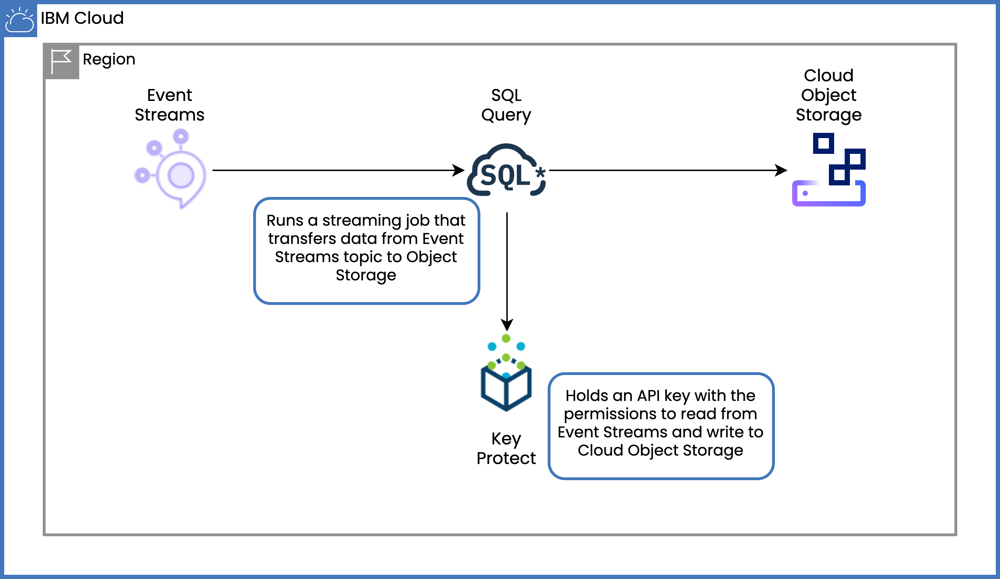

# Stream landing from Event Streams to Cloud Object Storage using SQL Query and Terraform

Learn how to archive your Event Streams Kafka data to Object Storage using SQL Query. This process, called stream landing, can be set up using the Terraform scripts provided in this repo.

For step by step instructions, check the blog post.
